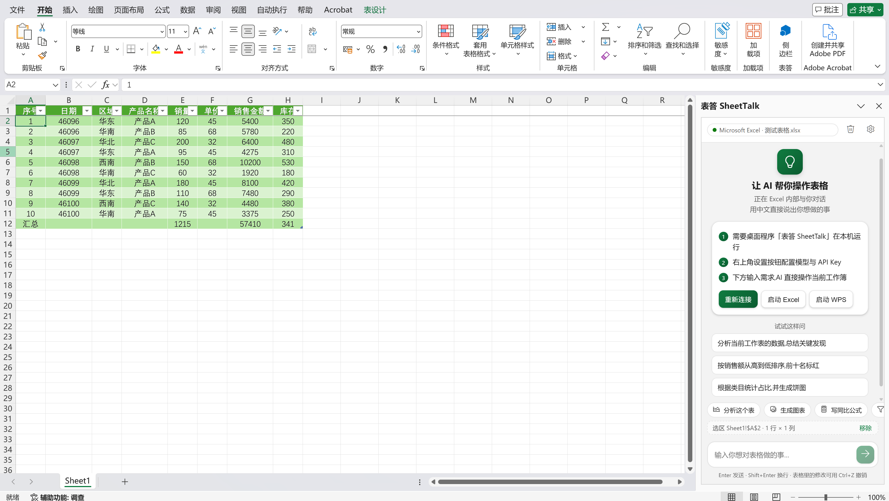
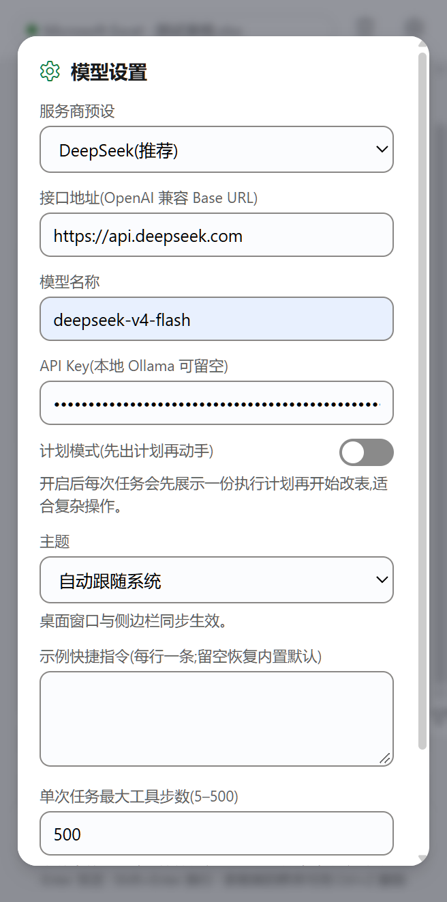
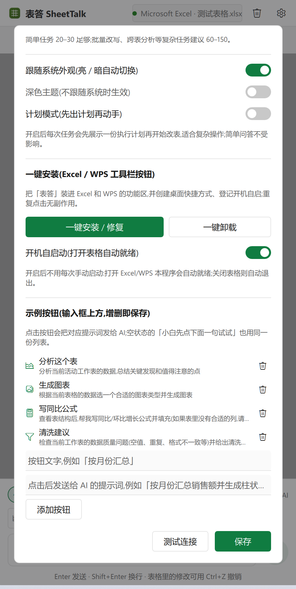

<div align="center">
  

# 表答 SheetTalk

**Excel / WPS 通用 AI 表格助手 —— 用中文对话,直接操作你正在打开的表格**

[English](README.en.md) | 简体中文

[](LICENSE)






</div>

---

一个**原生 Windows 桌面应用**(PySide6 / QML,Win11 Fluent 风格),通过 COM 自动化同时驱动
**Microsoft Excel** 和 **WPS 表格**,提供类 Microsoft 365 Copilot 的对话式 AI 能力:
分析数据、写公式、做图表、清洗数据、排版格式。

支持两种形态:**独立桌面窗口** + **表格内嵌侧边栏**(Excel 加载项 / WPS JS 加载项),
两种形态共享同一份对话,可同时使用。

## 截图

<div align="center">

<table>
<tr>
<td><br/>截图 1</td>
<td><br/>截图 2</td>
<td><br/>截图 3</td>
</tr>
</table>

</div>

<div align="center">
  <video controls width="640" src="assets/video.mp4" alt="表答 SheetTalk 演示视频"></video>
  <br/>
  <b>演示视频（640×360，约 3.7MB，可直接播放）</b>
</div>

---

## 目录

- [功能](#功能)
- [快速开始](#快速开始)
- [截图](#截图)
- [Excel 内侧边栏(Office 加载项)](#excel-内侧边栏office-加载项)
- [WPS 表格内侧边栏(WPS JS 加载项)](#wps-表格内侧边栏wps-js-加载项)
- [工作原理](#工作原理)
- [环境要求](#环境要求)
- [安全说明](#安全说明)
- [项目结构](#项目结构)
- [开发](#开发)
- [许可证](#许可证)

## 功能

- **对话式操作**:直接说"按销售额排序,前十名标红"、"在 G 列计算同比",AI 自动完成
- **数据分析**:自动读取表结构,总结关键发现、占比、趋势、异常
- **公式专家**:生成并批量填充公式(英文函数名写入,自动本地化显示)
- **图表生成**:根据数据特点选图型,一键插入
- **格式排版**:加粗、颜色、数字格式、对齐、列宽
- **完整 Markdown**:标题、表格、代码块实时渲染,流式逐字输出
- **计划模式**:复杂任务先给出执行计划,确认后再动手
- **选区即上下文**:Excel 里框选的区域自动作为对话上下文,可一键移除
- **两种形态**:独立桌面窗口 + 表格内侧边栏,共享同一会话
- **深浅色主题**:跟随系统亮暗自动切换,桌面端与侧边栏同步
- **托盘后台运行**:关闭窗口不退出,侧边栏服务保持可用;跟随启动(打开 Excel/WPS 自动就绪)
- **双软件兼容**:自动探测 Microsoft Excel → WPS 表格 → WPS 旧版
- **模型随便换**:任何 OpenAI 兼容接口 —— DeepSeek / 智谱 GLM / Kimi / 通义 / OpenAI / 本地 Ollama

## 快速开始

### 方式一:一键安装(推荐)

1. 双击 **一键安装.bat**(装依赖 → 注册 Excel/WPS 工具栏按钮 → 登记开机自启 → 建桌面快捷方式,装完自动启动)
2. 打开 Excel/WPS,点功能区「表答」→「侧边栏」(或直接用桌面窗口)
3. 点右上角齿轮填 API Key(只需一次),回来直接说中文需求

### 方式二:命令行

```bash
cd excel-ai-agent
pip install -r requirements.txt
python main.py
```

### 方式三:免 Python 直接运行

`build_exe.bat` 用 [Nuitka](https://nuitka.net) 打包,产物是单文件 `dist\ExcelAI.exe`
(约 34MB,onefile 压缩,Qt/Python 运行时全部内置)。复制到任意机器双击即用(首次仍需填
API Key);首次启动会解包运行时到 `%LOCALAPPDATA%\SheetTalk\<版本>`(约数秒),之后启动直接复用。

## Excel 内侧边栏(Office 加载项)

1. 点设置页「一键安装 / 修复」(或双击 一键安装.bat),加载项目录会注册到 Excel
2. **完全退出并重新打开 Excel**(Excel 只在启动时读取受信任目录)
3. 功能区:**插入 → 获取加载项 → 「共享文件夹」→ 选「表答 SheetTalk」→ 添加**
   (新版 Office 已不支持自动安装,这一步只需手动做一次)
4. 「开始」选项卡最右侧出现「表答」组 → 点「侧边栏」按钮

## WPS 表格内侧边栏(WPS JS 加载项)

1. 点设置页「一键安装 / 修复」(默认同时注册 Office + WPS)
2. **完全退出并重新打开 WPS 表格**
3. 功能区出现「表答」标签 → 点「侧边栏」按钮

部分 WPS 版本(12.1.0.16910+)默认关闭 JS 加载项:用记事本打开安装目录下
`office6\cfgs\oem.ini`,在 `[support]` 段加 `JsApiPlugin=true`,保存后重启 WPS
(安装脚本会自动检测并提示)。

## 工作原理

```
┌──────────────────────┐  Qt 信号(线程安全)  ┌──────────────────┐   COM 接口   ┌───────────────────┐
│  原生窗口(QML)      │ ◄───────────────── │  Python 控制器    │ ◄─────────► │  Excel / WPS 表格  │
│  对话 UI + Markdown  │                     │  Agent + 工具调用 │             │  (你正在打开的)    │
└──────────────────────┘                     │  ↕ LLM 流式 API  │             └───────────────────┘
                                             │                  ▲
┌──────────────────────┐                     │  共享会话/桥接     │
│ 表格内侧边栏          │ ◄── 127.0.0.1:8765 ─┘ (内置 HTTP 服务) │
│ (加载项任务窗格)     │        SSE + REST
└──────────────────────┘
```

AI 通过 **74 个表格工具**(读取/写入/公式/图表/格式/排序/查找替换/行列插删/冻结窗格/
合并单元格/保护/透视表/条件格式/超链接/显隐/工作表管理等)以 function calling
方式循环操作表格,每一步实时显示在对话里;COM 调用全部串行在专用线程,与 UI 完全隔离;
本机服务只监听 `127.0.0.1:8765`,无任何数据外发。

## 环境要求

- Windows 10/11
- Python 3.10+(已在 3.14 验证;使用打包版则无需 Python)
- Microsoft Excel(任意近期版本)**或** WPS 表格,至少安装其一
- 任一 OpenAI 兼容大模型 API Key(DeepSeek 有免费额度;完全离线可用 Ollama)

## 安全说明

- API Key 只保存在本机 `config.json`(打包版在 `%APPDATA%\ExcelAI`),只发往你自己填的模型接口
- 内置 HTTP 服务仅监听 `127.0.0.1:8765`,供本机侧边栏使用,不对局域网开放
- 对表格的所有操作都由本地 COM 直接执行,不经过任何第三方服务器

## 项目结构

```
excel-ai-agent/
├── main.py               # 入口(--smoke / --watch / --watch-guard)
├── app/
│   ├── qt_app.py         # Qt 引导(Fluent 风格、统一图标、托盘后台、QML 加载)
│   ├── qt_controller.py  # Qt 控制器:信号 ↔ Agent/COM 线程,状态轮询
│   ├── chat.py           # 共享对话会话(流式节流、事件翻译、中止)
│   ├── web_server.py     # 内置 HTTP 服务(侧边栏页面 + REST/SSE,仅 127.0.0.1)
│   ├── excel_bridge.py   # COM 桥接层(Excel/WPS 双兼容,单线程串行化)
│   ├── agent.py          # Agent 循环(上下文注入 + 工具调用 + 事件流)
│   ├── tools.py          # 74 个表格工具:全量注册表 + 工具 RAG 下发 + 执行
│   ├── llm.py            # OpenAI 兼容客户端(SSE 流式 + function calling)
│   ├── watcher.py        # 跟随启动监控(检测 Excel/WPS 自动拉起/收起)
│   ├── installer.py      # 一键安装/卸载(加载项 + 自启 + 快捷方式)
│   ├── runtime.py        # 运行形态探测(开发态 / PyInstaller / Nuitka)
│   └── config.py         # 配置读写(config.json)
├── qml/Main.qml          # Win11 Fluent 风格界面(原生渲染 Markdown)
├── addin/                # 表格内侧边栏
│   ├── manifest.xml      # Office 加载项清单(标准 VersionOverrides 结构)
│   ├── addin.html        # 侧边栏页面(流式对话 + Markdown 渲染 + 深色主题)
│   ├── sideload.py/.bat  # 注册脚本:Office 受信任目录 + WPS JS 加载项
│   └── wps/              # WPS JS 加载项源(ribbon.xml + main.js)
├── assets/               # 统一图标(icon.ico / icon.png)+ 截图 1/2/3+演示视频(video.mp4, 640×360, 3.7MB)+ 生成器 make_icon.py
├── selftest.py           # 离线自检(不需要 Excel 和 API Key)
├── live_demo_test.py     # 真机冒烟测试(需要打开 Excel)
├── install.py            # 一键安装/卸载命令行入口
├── requirements.txt
├── build_exe.bat         # Nuitka 打包脚本
└── LICENSE               # MIT 许可证
```

## 开发

```bash
python selftest.py          # 离线自检:不需 Excel、不需 API Key
python live_demo_test.py    # 真机端到端:需先打开 Excel/WPS(会新建演示工作簿)
python main.py --smoke      # UI 冒烟:启动约 6 秒后自动退出并截图 _gui_shot.png
build_exe.bat               # Nuitka onefile 打包 → dist\ExcelAI.exe(约 34MB)
```

改动约定与架构细节见 [AGENTS.md](AGENTS.md)(给 AI 编码代理与贡献者的项目说明)。

## 许可证

本项目以 [MIT 许可证](LICENSE) 开源 —— 可自由使用、修改、分发,商用亦可,保留版权声明即可。

Copyright (c) 2026 Zephyr-Isle
