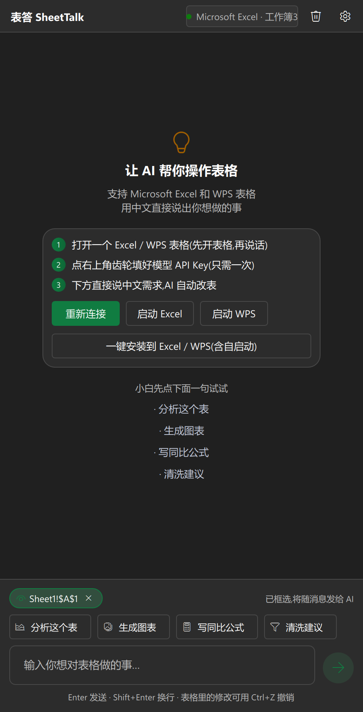

<div align="center">
  

# 表答 SheetTalk

**Excel / WPS 通用 AI 表格助手 —— 用中文对话,直接操作你正在打开的表格**

[English](README.en.md) | 简体中文



</div>

---

一个**原生 Windows 桌面应用**(PySide6 / QML,Win11 Fluent 风格),通过 COM 自动化同时驱动
**Microsoft Excel** 和 **WPS 表格**,提供类 Microsoft 365 Copilot 的对话式 AI 能力:
分析数据、写公式、做图表、清洗数据、排版格式。

支持两种形态:**独立桌面窗口** + **表格内嵌侧边栏**(Excel 加载项 / WPS JS 加载项),
两种形态共享同一份对话,可同时使用。

## 功能

- **对话式操作**:直接说"按销售额排序,前十名标红"、"在 G 列计算同比",AI 自动完成
- **数据分析**:自动读取表结构,总结关键发现、占比、趋势、异常
- **公式专家**:生成并批量填充公式(英文函数名写入,自动本地化显示)
- **图表生成**:根据数据特点选图型,一键插入
- **格式排版**:加粗、颜色、数字格式、对齐、列宽
- **完整 Markdown**:标题、表格、代码块实时渲染,流式逐字输出
- **计划模式**:复杂任务先给出执行计划,确认后再动手
- **选区即上下文**:Excel 里框选的区域自动作为对话上下文,可一键移除
- **两种形态**:独立桌面窗口 + 表格内侧边栏,共享同一会话
- **深浅色主题**:跟随系统亮暗自动切换,桌面端与侧边栏同步
- **托盘后台运行**:关闭窗口不退出,侧边栏服务保持可用;跟随启动(打开 Excel/WPS 自动就绪)
- **双软件兼容**:自动探测 Microsoft Excel → WPS 表格 → WPS 旧版
- **模型随便换**:任何 OpenAI 兼容接口 —— DeepSeek / 智谱 GLM / Kimi / 通义 / OpenAI / 本地 Ollama

## 快速开始

### 方式一:一键安装(推荐)

1. 双击 **一键安装.bat**(装依赖 → 注册 Excel/WPS 工具栏按钮 → 登记开机自启 → 建桌面快捷方式,装完自动启动)
2. 打开 Excel/WPS,点功能区「表答」→「侧边栏」(或直接用桌面窗口)
3. 点右上角齿轮填 API Key(只需一次),回来直接说中文需求

### 方式二:命令行

```bash
cd excel-ai-agent
pip install -r requirements.txt
python main.py
```

### 方式三:免 Python 直接运行

`build_exe.bat` 用 [Nuitka](https://nuitka.net) 打包,产物是单文件 `dist\ExcelAI.exe`
(约 34MB,onefile 压缩,Qt/Python 运行时全部内置)。复制到任意机器双击即用(首次仍需填
API Key);首次启动会解包运行时到 `%LOCALAPPDATA%\SheetTalk\<版本>`(约数秒),之后启动直接复用。

## Excel 内侧边栏(Office 加载项)

1. 点设置页「一键安装 / 修复」(或双击 一键安装.bat),加载项目录会注册到 Excel
2. **完全退出并重新打开 Excel**(Excel 只在启动时读取受信任目录)
3. 功能区:**插入 → 获取加载项 → 「共享文件夹」→ 选「表答 SheetTalk」→ 添加**
   (新版 Office 已不支持自动安装,这一步只需手动做一次)
4. 「开始」选项卡最右侧出现「表答」组 → 点「侧边栏」按钮

## WPS 表格内侧边栏(WPS JS 加载项)

1. 点设置页「一键安装 / 修复」(默认同时注册 Office + WPS)
2. **完全退出并重新打开 WPS 表格**
3. 功能区出现「表答」标签 → 点「侧边栏」按钮

部分 WPS 版本(12.1.0.16910+)默认关闭 JS 加载项:用记事本打开安装目录下
`office6\cfgs\oem.ini`,在 `[support]` 段加 `JsApiPlugin=true`,保存后重启 WPS
(安装脚本会自动检测并提示)。

## 工作原理

```
┌──────────────────────┐  Qt 信号(线程安全)  ┌──────────────────┐   COM 接口   ┌───────────────────┐
│  原生窗口(QML)      │ ◄───────────────── │  Python 控制器    │ ◄─────────► │  Excel / WPS 表格  │
│  对话 UI + Markdown  │                     │  Agent + 工具调用 │             │  (你正在打开的)    │
└──────────────────────┘                     │  ↕ LLM 流式 API  │             └───────────────────┘
                                             │                  ▲
┌──────────────────────┐                     │  共享会话/桥接     │
│ 表格内侧边栏          │ ◄── 127.0.0.1:8765 ─┘ (内置 HTTP 服务) │
│ (加载项任务窗格)     │        SSE + REST
└──────────────────────┘
```

AI 通过 **42 个表格工具**(读取/写入/公式/图表/格式/排序/查找替换/行列插删/冻结窗格/
合并单元格/保护/透视表/条件格式/超链接/显隐/工作表管理等)以 function calling
方式循环操作表格,每一步实时显示在对话里;COM 调用全部串行在专用线程,与 UI 完全隔离;
本机服务只监听 `127.0.0.1:8765`,无任何数据外发。

## 环境要求

- Windows 10/11
- Python 3.10+(已在 3.14 验证;使用打包版则无需 Python)
- Microsoft Excel(任意近期版本)**或** WPS 表格,至少安装其一
- 任一 OpenAI 兼容大模型 API Key(DeepSeek 有免费额度;完全离线可用 Ollama)

## 使用示例

| 你说 | AI 做 |
|---|---|
| 分析一下这个表 | 读取表结构 → 统计 → 输出 Markdown 表格结论 |
| 按 B 列从高到低排序 | 调用 sort_range 完成 |
| 在 D 列算利润率,保留 1 位小数 | 写公式 → autofill 填充整列 → 设百分比格式 |
| 各产品销售占比画个饼图 | 统计 + create_chart 插入图表 |
| 表里有重复行和空值吗 | 读取检查 → 给出清洗建议或直接清洗 |

## 常见问题

**Q: 和微软官方 Copilot 有什么区别?**
官方 Copilot 需要 M365 订阅;本方案自带模型、可用国产 API 或自建网关,且 WPS 也能用。

**Q: 为什么是独立软件而不是加载项?**
一套代码同时兼容 Excel 与 WPS 的唯一可靠路径就是 COM:两家都完整实现了 Excel 对象模型,
而各自的"加载项"体系互不兼容。独立原生窗口还免去签名、HTTPS 托管等麻烦。

**Q: AI 改错了怎么办?**
表格里的修改是标准 COM 写入,Excel/WPS 里 **Ctrl+Z 即可撤销**;
也可以直接对 AI 说"把刚才的改动改回去"。

**Q: 提示"已达本轮工具步骤上限"?**
在设置里调大「单次任务最大工具步数」(5–500),或把需求拆小一点。

**Q: 哪些模型好用?**
需要支持 function calling:推荐 `deepseek-chat`、`glm-4.6`、`kimi-k2`、`qwen-plus`。

## 确认体系与安全模型

工具越多,「模型乱调工具」的风险越大。表答用三层机制控制:

**1. 工具 RAG:每轮只给模型相关的工具**

74 个工具的 schema 全量发送会占用 8.5K tokens/轮。表答改为:
每轮只下发「常驻核心(读写/概况/保存)+ 按你的请求检索命中的 top-5 +
元工具(search_tools / call_tool)」,约 2.6K tokens,省 73%。

- 检索命中:常见操作一步直达
- 检索没中:模型自己 `search_tools` 找到工具再 `call_tool` 调用,不会失败

**2. 危险操作二次确认(确认条)**

删除工作表/删除行列/删除图表/清空区域/关闭工作簿/两级保护这类操作,
执行前会弹出**琥珀色确认条**(桌面为横幅、侧边栏为确认条),Codex 风格下拉:

- **仅本次允许执行**(默认)
- **本会话始终允许该工具** —— 需勾选「我了解风险」二次确认,避免手滑永久放行
- **拒绝执行** —— 确认按钮变红;允许时保持品牌绿

确认条由 SSE 实时推送(毫秒级),页面崩溃/刷新后通过 `/api/pending_confirm`
自动恢复弹出(轮询兜底);180 秒未决断自动取消。拒绝后 Agent 会收到
「用户未确认」并给出替代方案,不会换个名字重试。

**3. 会话豁免清单(可撤销)**

选「始终允许」会记入会话豁免清单(作用域 = 工具名 + 主参数,例如
`delete_sheet:Sheet2` 只豁免对 Sheet2 的删除,换一个对象仍会确认)。
确认条底部可展开查看本会话豁免了哪些操作,并支持**一键全部撤销**。

**参数与白名单防线**

- 所有工具参数先按 JSON Schema 校验/纠正(数字字符串自动转数字、必填/枚举检查),失败不执行
- `call_tool` 无法调用危险清单内的工具(防止绕过确认)
- 危险清单支持热加载:编辑 `dangerous_tools.json`(配置目录下)即可追加,无需改代码重打包

**4. 启动期自检**

程序启动时验证确认流/工具注册/参数校验/检索的关键不变量,
失败会在 UI 顶部以红色横幅明示(同时进 app.log 与侧边栏),
把「运行时才炸」的隐患提前到启动期暴露。

**5. 可观测性**

app.log 记录完整决策链:检索 query 与命中列表 → 每次工具调用的名称与参数 →
执行结果 → 二次确认请求与用户决定,可事后审计模型的每一步。

## 安全说明

- API Key 只保存在本机 `config.json`(打包版在 `%APPDATA%\ExcelAI`),只发往你自己填的模型接口
- 内置 HTTP 服务仅监听 `127.0.0.1:8765`,供本机侧边栏使用,不对局域网开放
- 对表格的所有操作都由本地 COM 直接执行,不经过任何第三方服务器

## 项目结构

```
excel-ai-agent/
├── main.py               # 入口(--smoke / --watch / --watch-guard)
├── app/
│   ├── qt_app.py         # Qt 引导(Fluent 风格、统一图标、托盘后台、QML 加载)
│   ├── qt_controller.py  # Qt 控制器:信号 ↔ Agent/COM 线程,状态轮询
│   ├── chat.py           # 共享对话会话(流式节流、事件翻译、中止)
│   ├── web_server.py     # 内置 HTTP 服务(侧边栏页面 + REST/SSE,仅 127.0.0.1)
│   ├── excel_bridge.py   # COM 桥接层(Excel/WPS 双兼容,单线程串行化)
│   ├── agent.py          # Agent 循环(上下文注入 + 工具调用 + 事件流)
│   ├── tools.py          # 15 个表格工具的 schema 与执行
│   ├── llm.py            # OpenAI 兼容客户端(SSE 流式 + function calling)
│   ├── watcher.py        # 跟随启动监控(检测 Excel/WPS 自动拉起/收起)
│   ├── installer.py      # 一键安装/卸载(加载项 + 自启 + 快捷方式)
│   ├── runtime.py        # 运行形态探测(开发态 / PyInstaller / Nuitka)
│   └── config.py         # 配置读写(config.json)
├── qml/Main.qml          # Win11 Fluent 风格界面(原生渲染 Markdown)
├── addin/                # 表格内侧边栏
│   ├── manifest.xml      # Office 加载项清单(标准 VersionOverrides 结构)
│   ├── addin.html        # 侧边栏页面(流式对话 + Markdown 渲染 + 深色主题)
│   ├── sideload.py/.bat  # 注册脚本:Office 受信任目录 + WPS JS 加载项
│   └── wps/              # WPS JS 加载项源(ribbon.xml + main.js)
├── assets/               # 统一图标(icon.ico / icon.png)+ 生成器 make_icon.py
├── selftest.py           # 离线自检(不需要 Excel 和 API Key)
├── live_demo_test.py     # 真机冒烟测试(需要打开 Excel)
├── install.py            # 一键安装/卸载命令行入口
├── requirements.txt
└── build_exe.bat         # Nuitka 打包脚本
```
